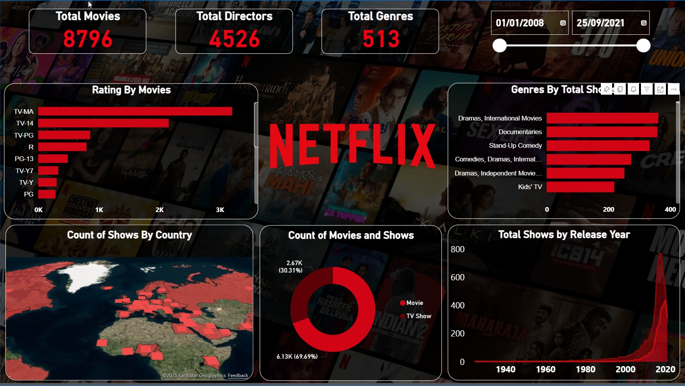

# Netflix Movies & TV Shows Dashboard – Power BI Project

Interactive Netflix Analytics Dashboard built using Power BI to analyze movies, TV shows, genres, ratings, and global distribution.

---

## Executive Summary

I developed an **Interactive Netflix Dashboard using Power BI** to analyze the Netflix movies and TV shows dataset. The dashboard provides insights into content distribution, genres, ratings, release trends, and global availability.

This dashboard helps understand how Netflix content is distributed across countries, how genres and ratings are structured, and how the number of shows has evolved over time.

The dataset includes **8,796 movies**, **4,526 directors**, and **513 genres**, providing a comprehensive view of Netflix's content library.

---

## Business Problem

Streaming platforms like Netflix host thousands of movies and TV shows across multiple genres, ratings, and countries. Without proper analytics tools, it becomes difficult to understand content distribution, audience targeting, and production trends.

Decision makers need an analytical dashboard that answers questions such as:

- How many movies and TV shows are available on Netflix?
- Which genres dominate the platform?
- What content ratings are most common?
- Which countries produce the most Netflix content?
- How has Netflix content grown over time?

Without centralized visualization, analyzing these insights becomes complex.

---

## Interactive Power BI Dashboard

### Netflix Content Overview

---

## KPI Summary

- **Total Movies:** 8,796  
- **Total Directors:** 4,526  
- **Total Genres:** 513  

### Movies vs TV Shows Distribution

- **Movies:** ~69.7%  
- **TV Shows:** ~30.3%

---

## Key Insights

- Movies dominate Netflix content, representing nearly **70% of total titles**.
- TV-MA and TV-14 ratings appear most frequently, indicating mature audience targeting.
- International dramas and documentaries are among the most common genres.
- Netflix content production increased significantly after **2015**, with rapid growth until **2020**.
- The United States and several international markets contribute heavily to Netflix's content library.

---

## Business Recommendations

- Continue investing in **international content**, as global audiences are expanding rapidly.
- Focus on **high-performing genres** such as drama, documentaries, and stand-up comedy.
- Maintain a balanced mix of **movies and TV shows** to target diverse audiences.
- Analyze regional content trends to expand in emerging markets.

---

## Tools & Technologies Used

- Power BI  
- Power Query  
- DAX  
- Data Modeling  
- Data Visualization  

---

## Impact

This dashboard demonstrates how data analytics can help streaming platforms:

- Understand content distribution
- Identify trending genres
- Monitor production growth
- Analyze global content availability
- Support strategic content planning

---

⭐ If you found this project useful, consider giving it a star!
